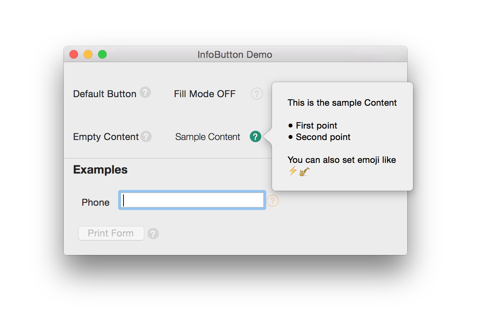
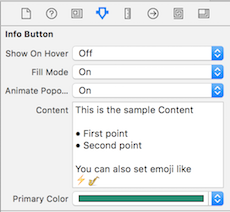

#InfoButton

`InfoButton` is simple and lightweight Information Button for Mac OSX implemented in Swift


##Features
- Easy to Use
- Light Mode and Fill Mode
- Simple and lightweight

##Requirements
- Mac OS X 10.9
- Xcode 6

##Installation
####Direct
Drag `InfoButton.swift` to your project. That is it!

####CocoaPods
[CocoaPods 0.36](http://cocoapods.org) adds supports for Swift and embedded frameworks.

To integrate InfoButton into your Xcode project using CocoaPods, specify it in your `Podfile`:

```ruby
use_frameworks!

pod 'InfoButton'
```

Then, run the following command:

```bash
$ pod install
```


##Usage
In Interface builder, drag a `Custom View` from Object Library and set `Custom Class` to `InfoButton`

Since InfoButton is `@IBDesignable`, Attribute Inspector gets updated like this.



Update `Fill Mode`, `Content` and `Primary Color` and there you have InfoButton ready without writing a single line of code.

##Notes
- Make sure the height and width of InfoButton are `equal`
- Press ⌥ ↩ for newline in text field of IB.(Option + Return)

##Todo
- RTF Support for Popover content
- Popover auto disappear

##License
`InfoButton` is released under the MIT license. See LICENSE for details.

